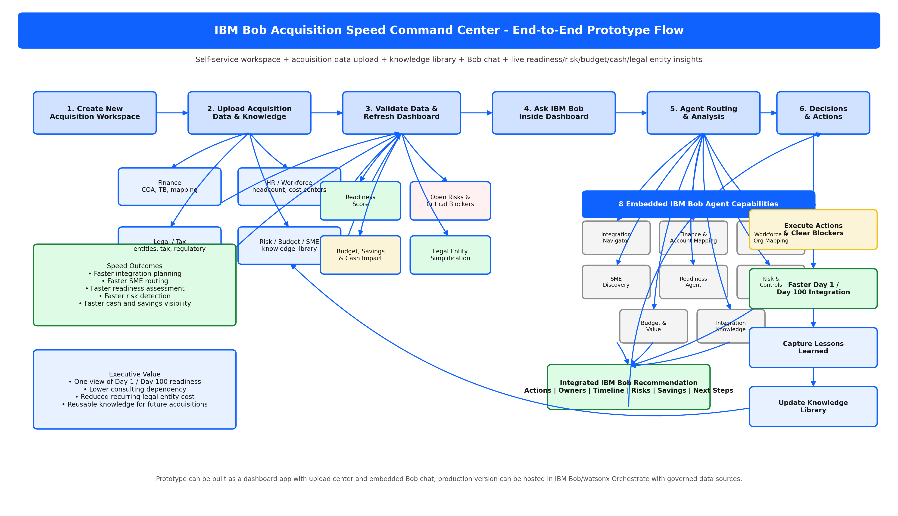

# IBM Bob Acquisition Speed Command Center

## Overview
IBM Bob Acquisition Speed Command Center is a self-service prototype designed to accelerate new acquisition and legal entity integration from Day 1 to Day 100. It combines a single IBM Bob experience, embedded agent capabilities, a live dashboard, a workspace creator, a data upload center, and a knowledge library.

## Challenge Statement
Acquisition integration is often slowed by inconsistent processes, manual mapping work, fragmented readiness visibility, and difficulty identifying the right SMEs. This project focuses on speed: faster onboarding, faster decision-making, faster risk identification, and faster value realization.

## Core Concept
Users create a new acquisition workspace, upload acquisition data and knowledge files, ask IBM Bob questions, and receive live insights on:

- Readiness
- Risks and blockers
- Budget and cash impact
- SME routing
- Legal entity simplification opportunities

## Key Capabilities
- Workspace creation for new acquisition projects
- Data upload center for finance, HR, legal, tax, risk, budget, SME, and knowledge files
- IBM Bob chat for process, mapping, readiness, and risk questions
- Live dashboard with readiness, risk, budget, and value metrics
- Knowledge library for playbooks, policies, checklists, and lessons learned
- Legal entity view with retain / merge / dissolve / further review recommendations

## Embedded Agent Capabilities
1. Integration Navigator
2. Finance & Account Mapping
3. Workforce & Organization Mapping
4. SME Discovery
5. Integration Readiness
6. Risk & Controls
7. Budget & Value Tracking
8. Integration Knowledge

## End-to-End Flow
1. Create workspace
2. Upload acquisition data
3. Refresh dashboard
4. Ask IBM Bob
5. Route to the relevant embedded capability
6. Receive integrated recommendations
7. Support leadership decisions
8. Capture lessons learned for reuse

## Documents
- [Project Plan Write-Up](docs/IBM_Bob_Acquisition_Speed_Command_Center_Project_Plan%20Write%20Up.docx)
- 

## Prototype Setup
### Prerequisites
- Python 3

### Install dependencies
```powershell
python -m pip install streamlit pandas
```

### Run the app
```powershell
python -m streamlit run app.py
```

### Sample data
The prototype uses default files from [`sample_data/`](sample_data/):
- [`sample_data/integration_status.csv`](sample_data/integration_status.csv)
- [`sample_data/risks.csv`](sample_data/risks.csv)
- [`sample_data/budget.csv`](sample_data/budget.csv)
- [`sample_data/legal_entities.csv`](sample_data/legal_entities.csv)
- [`sample_data/sme_directory.csv`](sample_data/sme_directory.csv)
- [`sample_data/knowledge_library.txt`](sample_data/knowledge_library.txt)

### Uploads
The app sidebar includes a Data Upload Center. If you upload replacement files, the app uses them instead of the default files in [`sample_data/`](sample_data/).

## Demo Script
1. Run the prototype with [`python -m streamlit run app.py`](python:1).
2. Open the **Dashboard** tab and explain the readiness, risk, spend, and savings metrics.
3. Review the **Current Workspace Summary** to highlight tracked areas and legal entity opportunity.
4. Open the **Integration Status**, **Risks**, and **Budget** tabs to show the underlying source data.
5. Open the **Legal Entities** tab and explain the [`recommended_action`](app.py:45) column.
6. Open the **SME Directory** tab and highlight the Japan payroll SME example.
7. Open the **Knowledge Library** tab and explain how approved content can be reused.
8. Open the **IBM Bob Q&A** tab and walk through the sample questions.
9. Close with the business value: faster integration decisions, clearer ownership, faster SME routing, better risk visibility, and simplification opportunity.

## Success Measures
- 40-60% faster integration planning and mobilization
- 50-70% reduction in SME search time
- 30-50% reduction in initial account and cost center mapping effort
- Immediate dashboard visibility after data upload
- Better visibility into risks, budget, savings, cash impact, and entity simplification

## Next Steps
- Expand the prototype workflow and dashboard experience
- Add more advanced recommendation logic and insights
- Integrate the project write-up into working application components
- Prepare the prototype for demo and challenge submission
